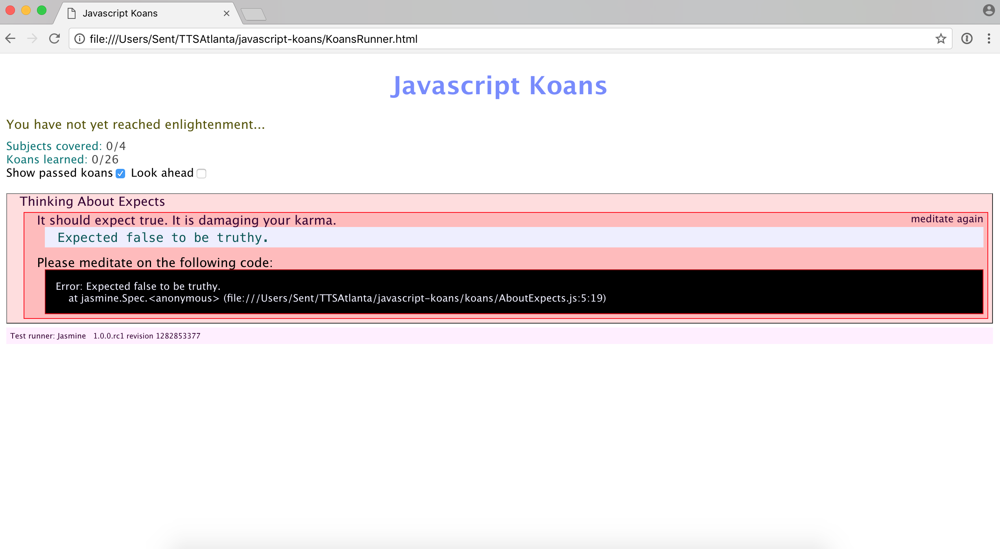

# Javascript Koans Part 1

## Instructions

1. Clone this repo to your local machine.
1. Open `KoansRunner.html` in Chrome.
1. Open the folder in VS Code.
1. Modify every `FILL_ME_IN` in the koans folder in the following files:

* `AboutExpects.js`
* `AboutArrays.js`
* `AboutFunctions.js`
* `AboutObjects.js`

## You should see this in Chrome when you begin

