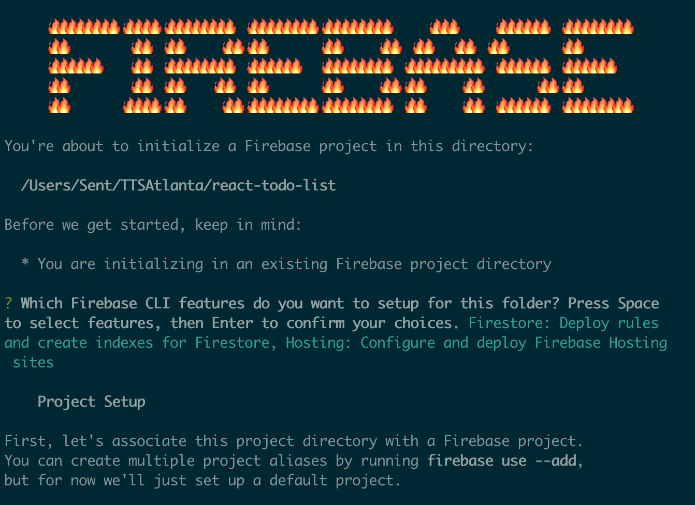
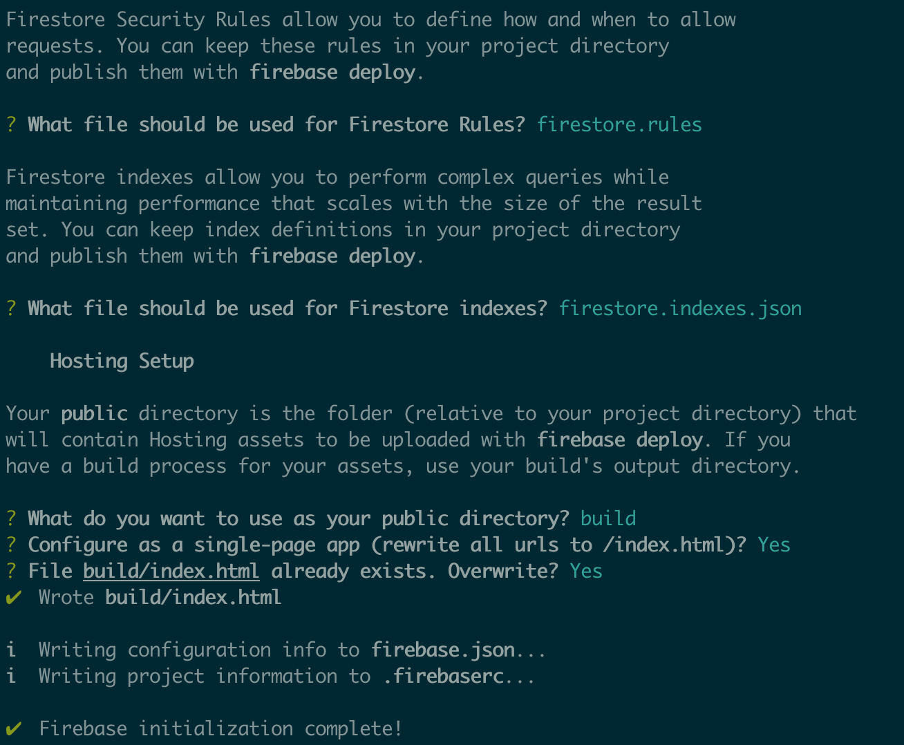

# Pure Components, Firebase Deployment and Extra Resources

## Pure Components

## Firebase Deployment

[https://youtu.be/jsRVHeQd5kU](https://youtu.be/jsRVHeQd5kU)

### Initialize

The very first thing we need to do is to install Firebase CLI (Command Line Interface) globally so that we can access firebase from any directory. Make sure you have node.js and npm installed. Open terminal or command prompt and run the following command.

`npm install -g firebase-tools`

Make sure you are in the root folder of your project. Now run the below command:

`firebase init`

Running the above command will walk you through the setup process. First of all, it will ask you to select Firebase CLI features.

There are only 2 we care about here:

1.  Firestore
1.  Hosting

You can select an option by pressing Space key on your keyboard.

Next, Firebase will ask you to select a project from among the one’s you have already created or just create a new one. I already have my project on Firebase, so I will just select that one.

Then, Firebase will ask you to name the firestore rules file. Just press Enter and Firebase will create a `firestore.rules.json` file in the project root directory. If you have already specified firestore rules in Firebase, then those will be copied to `firestore.rules.json` file.

Lastly, Firebase will ask to specify a folder which will contain all the files to be deployed to Firebase Hosting. By default directory name will be `public` but you can type in a different name. In our case Create React App provides a simple command `npm run build` to create a compressed version of the app into the build folder.

So type in `build` for the Firebase public folder. Press Enter and Firebase setup should complete successfully.

### Deploy

To deploy your app, type the below command in terminal and press Enter.

`firebase deploy`

If everything goes well, you should see `$ deploy complete` and you should get hosting URL (live app URL). Firebase also provides an option to use custom URL which we won’t be covering.

The dashboard on `www.firebase.google.com` allows for easy rollbacks and usage stats.

## Extra Resources
